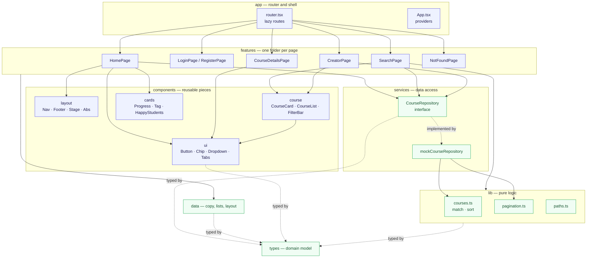
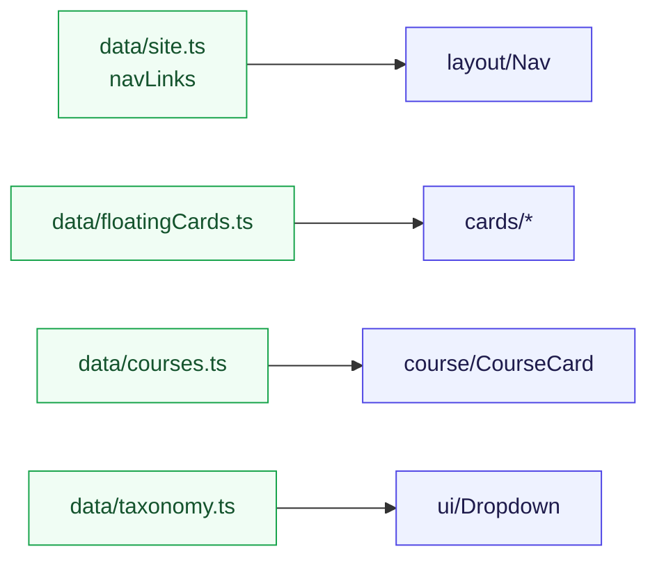
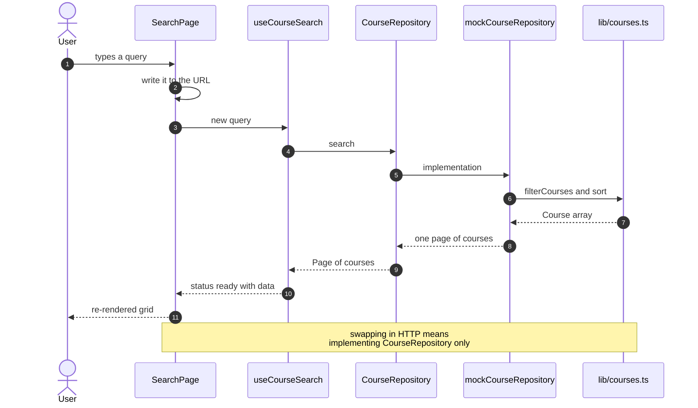
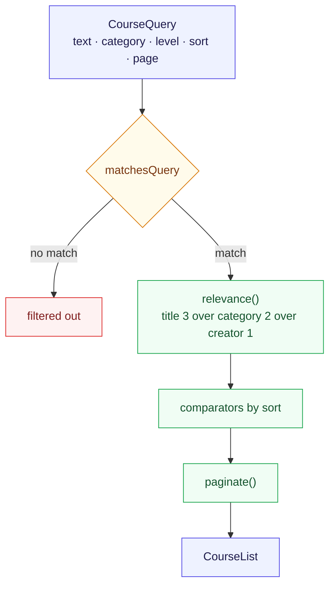
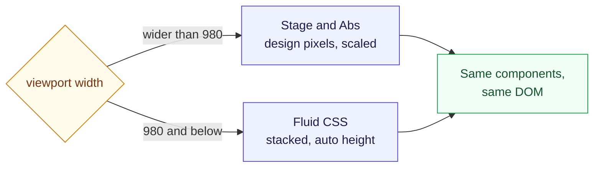
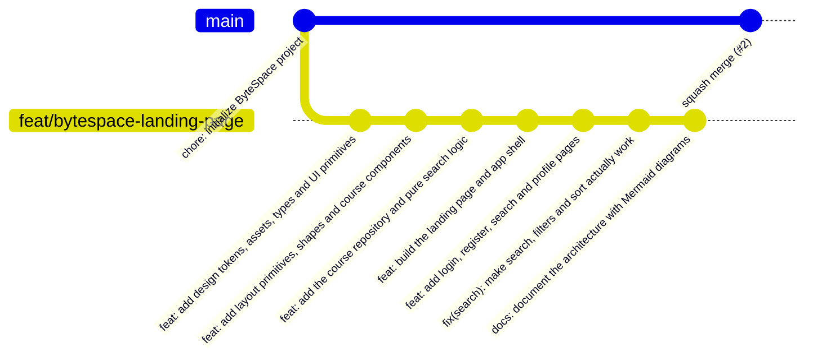

<div align="center">

# ByteSpace — Frontend

**Landing page, login and register built from the Figma design**

React 18 · TypeScript · Vite · React Router 6 · CSS Modules

[](https://bytespace-frontend-sable.vercel.app)
[](https://github.com/kaziahosunhabibripon/bytespace-frontend)
[](https://github.com/kaziahosunhabibripon/bytespace-frontend/pull/2)

**Live:** <https://bytespace-frontend-sable.vercel.app>

</div>

---

## Table of Contents

- [Overview](#overview)
- [Tech Stack](#tech-stack)
- [Pages](#pages)
- [Architecture](#architecture)
- [Data Flow](#data-flow)
- [Search, Filter and Sort](#search-filter-and-sort)
- [Design System](#design-system)
- [Getting Started](#getting-started)
- [Quality Checks](#quality-checks)
- [Git Workflow](#git-workflow)
- [Deployment](#deployment)
- [Reviewer Notes](#reviewer-notes)

---

## Overview

A front-end implementation of the **ByteSpace "New"** Figma design — an online course marketplace.
The landing page is the required deliverable; login and register are the bonus pages. Search,
course details, creator profile and a 404 route are included to show the patterns being reused
across pages.

The project is written to be **data-driven** and **reusable**: no copy, list or layout constant is
hard-coded in a component, and every page is assembled from the same small set of primitives.

---

## Tech Stack

| Layer | Choice | Why |
|---|---|---|
| UI | React 18 + TypeScript (strict) | typed domain model end to end |
| Build | Vite 5 | fast builds, native ESM |
| Routing | React Router 6 | lazy, code-split routes |
| Styling | CSS Modules | scoped styles, zero runtime |
| Fonts | Satoshi + Poppins | self-hosted, no external requests |
| Tests | Vitest + Testing Library | 37 unit and component tests |
| Lint | ESLint | `typescript-eslint`, `react-hooks`, `jsx-a11y` |

---

## Pages

| Page | Route | Status |
|---|---|---|
| Landing | `/` | required |
| Login | `/login` | bonus |
| Register | `/register` | bonus |
| Search | `/search` | extra |
| Course details — About / Lessons / Reviews | `/courses/:id` · `/courses/:id/:tab` | extra |
| Creator profile | `/creators/:id` | extra |
| Not found | `*` | extra |

---

## Architecture

Dependencies point in one direction only — `features` may use `components`, `components` may use
`ui`, and nothing lower ever imports a higher layer.



### Layer responsibilities

| Layer | May know about | Must not know about |
|---|---|---|
| `features/` | components, services, lib, data | — |
| `components/ui/` | only itself | the domain, routing, data |
| `services/` | lib, types | React components |
| `lib/` | types | React, services, data |
| `data/` | types | everything else |

### Data-driven by design

Copy, lists and layout constants live in `src/data` as arrays. Components only map over them, so
adding a course, a nav link or a testimonial never requires touching a component.



---

## Data Flow

Features never import the mock directly. They depend on the `CourseRepository` interface, provided
through React context — so swapping in a real API touches one file.



`useAsync` keeps the previous page on screen while a new one loads, so the grid never flashes empty.

---

## Search, Filter and Sort

Every filter on `/search` lives in the URL, so any result set is shareable and survives a reload.

| Control | Param | Behaviour |
|---|---|---|
| Search box | `?q=` | Matches title, creator, level **or** category; title hits rank first |
| Category chips | `?category=` | Exact category match |
| Level dropdown | `?level=` | Beginner / Intermediate / Advanced |
| Sort dropdown | `?sort=` | Most relevant / Highest rated / Price low→high / Price high→low |
| Pagination | `?page=` | 18 courses per page |
| Filter button | — | Clears text, category and level at once |

Changing any filter returns to page 1. `Level` and `Sort` also work on the creator profile.



All matching and ordering lives in `src/lib/courses.ts` as pure functions, so it is tested without
React.

---

## Design System

Figma values are extracted into CSS variables in `src/styles/tokens.css` and consumed everywhere
else — no hard-coded colours or spacing in components.

| Token | Value | Used for |
|---|---|---|
| `--color-blue` | `#003BE2` | Primary actions, brand |
| `--color-lime` | `#D4FB20` | Highlights, selected states |
| `--color-ink` | `#040819` | Headings |
| `--color-text-subtle` | `#82868E` | Secondary text |
| `--container-width` | `1200px` | Content width |
| `--design-width` | `1440px` | Figma canvas width |

### Responsive strategy

Sections drawn on the 1440px Figma canvas use `Stage` + `Abs`: children are positioned in design
pixels and the whole canvas scales down on narrow screens, so those frames keep their proportions.
Everything else is fluid.



---

## Getting Started

Requires Node 18+.

```bash
npm install
npm run dev          # http://localhost:5173
```

| Script | Purpose |
|---|---|
| `npm run dev` | Dev server with HMR |
| `npm run build` | Typecheck + production bundle |
| `npm run preview` | Serve the production build locally |
| `npm test` | Vitest, single run |
| `npm run lint` | ESLint |
| `npm run typecheck` | `tsc --noEmit` |
| `npm run format` | Prettier |

No environment variables are required — the app is fully static.

---

## Quality Checks

```bash
npm run typecheck   # tsc --noEmit, strict
npm run lint        # typescript-eslint, react-hooks, jsx-a11y
npm test            # 37 unit + component tests
npm run build       # typecheck + production bundle
```

All four pass, and **every commit in the history builds on its own** — each was verified with
`npm run build` in isolation.

Coverage includes the filtering and sorting rules, pagination, URL parsing, the route table, the
repository contract and the UI primitives.

---

## Git Workflow

Work was developed on a feature branch and merged through a Pull Request rather than committed
straight to `main`.



| Branch | Purpose |
|---|---|
| `main` | Scaffold base, receives merged work |
| `feat/bytespace-landing-page` | The implementation |

---

## Deployment

Live at <https://bytespace-frontend-sable.vercel.app>, connected to the `main` branch so every merge
rebuilds automatically.

`vercel.json` pins the framework preset and adds the SPA rewrite, so deep links such as
`/courses/1/reviews` survive a page refresh:

```json
"rewrites": [{ "source": "/((?!assets/|fonts/|img/).*)", "destination": "/index.html" }]
```

Routes are also code-split with `React.lazy`, so the landing page does not download the code for
course details or the creator profile.

---

## Reviewer Notes

- **Fonts and assets** are the originals from the Figma file — photos, avatars, logos and 3D shapes
  are served from `public/`.
- **Icons** were redrawn as a single SVG registry (`components/ui/Icon.tsx`) because Figma's vector
  data is not retrievable without a Figma login. Every icon inherits `currentColor`.
- **Login and register** validate the form and route onwards, but there is no backend yet, so they
  do not authenticate. Wiring a real API means implementing `CourseRepository` — no component
  changes.
- **Course data** is generated from seeds in `src/data/courses.ts`; the design provides one
  course-detail text, so every course renders that copy.
- **A few Figma frames are internally inconsistent** (the Lessons tab starts 17px lower than About;
  the first testimonial is set tighter than the other two). Those quirks are kept deliberately and
  expressed as data or small variants rather than magic numbers.